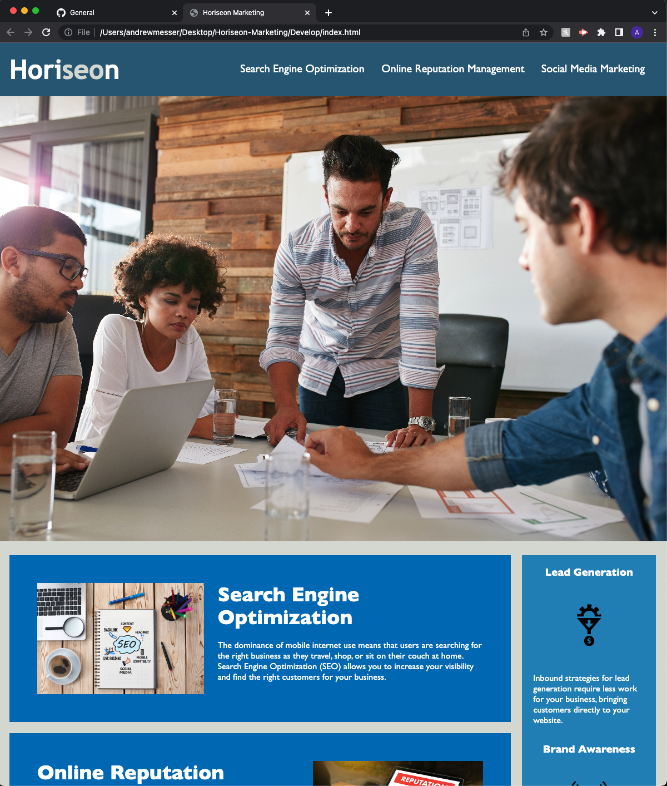

# <Horiseon Marketing Refactor>

## Refactor the Horiseon webpage to include accesablitly tags and a Title

- The client wants their webpage to include accesabiltiy features and to add a Title to be seen in the webpages browser tab.
- To add accesability features and information to assist with screen readers, video captions, and brail keyboards or in instances of the images not rendering on viewers webpage.
- This will allow users with disabilities to know what the images are by reading the alt tags on the images and giving the user a discreption.
- I learned the importance of alt tags and their importance to potential users of a webpage. 

## Usage

[HoriseonMarketing](https://amess33.github.io/Horiseon-Marketing/)

|As you navigate the website you will notice a TITLE of "Horiseon Marketing" is in the Tab of the webpage browser. If you click on the 3 options in the header you will be redirected to the paragraphs they represent below. If the imagaes fail to load you will see discreptive text to represent what the images intended to show|

