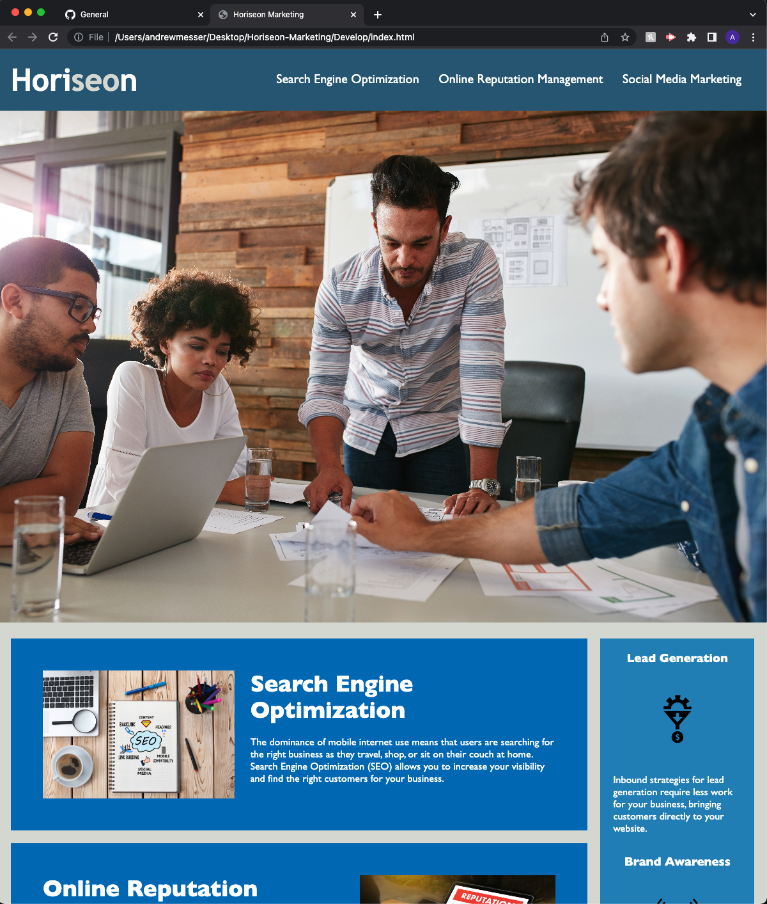

# <Horiseon Marketing Refactor>

## Refactor the Horiseon webpage to include accesablitly tags and a Title

- The client wants their webpage to include accesabiltiy features and to add a Title to be seen in the webpages browser tab.
- To add accesability features and information to assist with screen readers, video captions, and brail keyboards or in instances of the images not rendering on viewers webpage.
- This will allow users with disabilities to know what the images are by reading the alt tags on the images and giving the user a discreption.
- I learned the importance of alt tags and their importance to potential users of a webpage. 

## Usage

Provide instructions and examples for use. Include screenshots as needed.

To add a screenshot, create an `assets/images` folder in your repository and upload your screenshot to it. Then, using the relative filepath, add it to your README using the following syntax:

